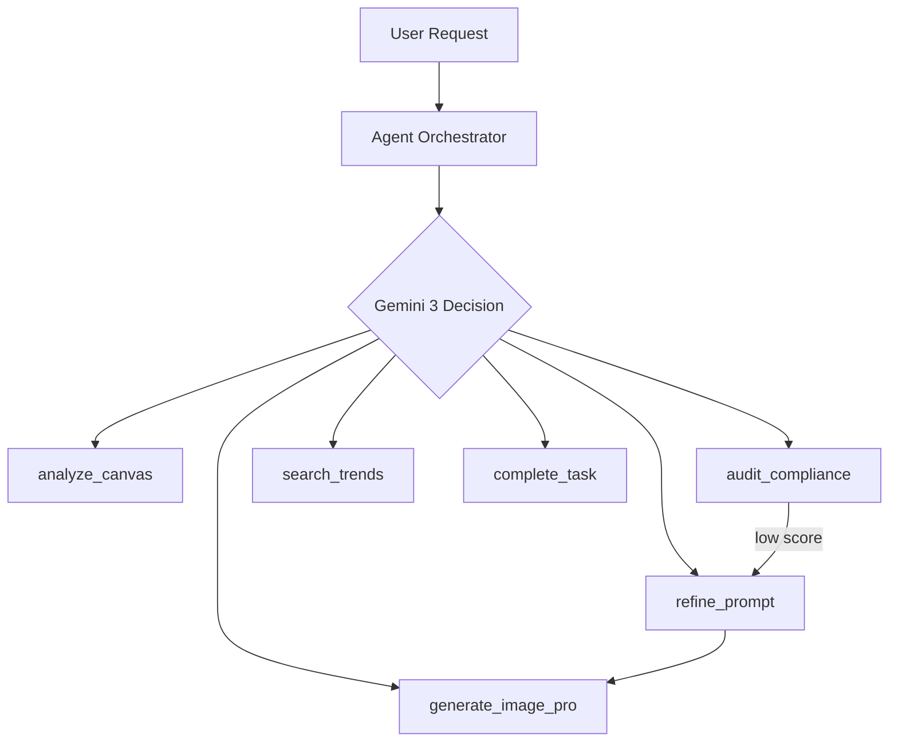

# Sentient Studio - Product Requirements Document

> AI-Powered Marketing Asset Generator with Autonomous Agents built on **Gemini 3**

---

## Overview

Sentient Studio enables marketing teams to create on-brand assets through a frontier agentic workflow:

1. **Canvas**: Upload moodboard images and define brand elements
2. **Constitution**: **Gemini 3 Flash** extracts brand DNA (colors, style, voice)
3. **Generation**: Agent autonomously creates pro-grade assets
4. **Audit**: **Gemini 3** validates brand compliance with native thinking
5. **Output**: Approved high-fidelity asset ready for use

---

## Architecture

### Technology Stack

- **Frontend**: Next.js 15 (App Router, React 19)
- **AI**: Gemini 3 Family (Flash, Pro, Image)
- **Thinking Mode**: Native `thinkingLevel: "high"` enabled
- **State**: Zustand
- **Database**: Firestore

### Agentic System

This is a **true agentic system** built on Gemini 3's frontier reasoning:



---

## Model Selection (Gemini 3)

| Usage | Model | Key Capability |
|-------|-------|----------------|
| **Default/Loop** | `gemini-3-flash` | Frontier speed + High thinking |
| **Image (Pro)** | `gemini-3-pro-image-preview` | 4K resolution + Advanced text |
| **Search/Trends** | `gemini-3-flash` | Google Search grounding |
| **Reasoning** | Unified `gemini-3` | Native `thinkingConfig` |

---

## Key Features

### 1. High-Level Native Thinking

Leverages Gemini 3's `thinkingLevel: "high"` to replace complex prompt engineering with native reasoning.

### 2. Market Grounding

Uses Gemini 3 Flash to verify design trends via real-time search.

### 3. Integrated Computer Use

Ready for future automation with built-in Computer Use support in Gemini 3 models.

### 4. Professional Asset Production

Nano Banana Pro (`gemini-3-pro-image-preview`) excels at complex multi-turn creation and high-resolution output.

---

## Environment Variables

```env
GEMINI_API_KEY= # Frontier access required
```

---

## Future Roadmap

- [ ] PDF & Document branding analysis
- [ ] Multi-turn image editing (Inpainting)
- [ ] A/B Variant batch generation
