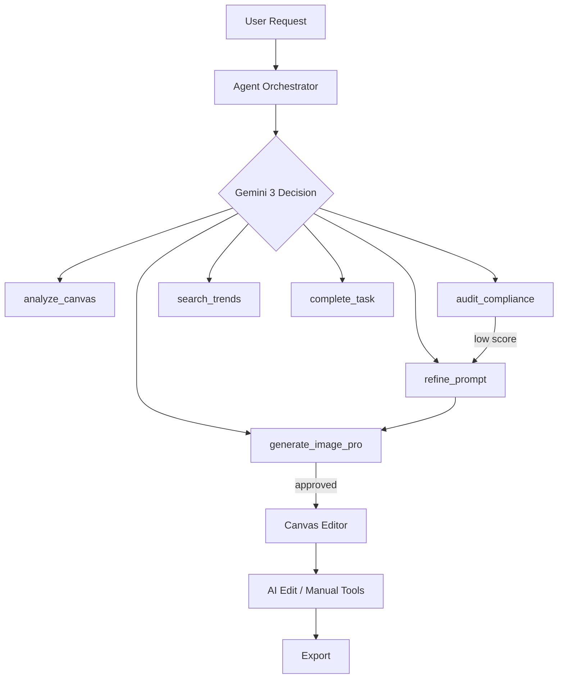

# Sentient Studio - Product Requirements Document

> AI-Powered Marketing Asset Generator with Autonomous Agents & **Hybrid Canvas Editor** — built on **Gemini 3**

---

## Overview

Sentient Studio enables marketing teams to create on-brand assets through a frontier agentic workflow:

1. **Canvas**: Upload moodboard images and define brand elements
2. **Constitution**: **Gemini 3 Flash** extracts brand DNA (colors, style, voice)
3. **Generation**: Agent autonomously creates pro-grade assets
4. **Audit**: **Gemini 3** validates brand compliance with native thinking
5. **Edit**: Hybrid canvas — manual tools + AI-assisted editing
6. **Output**: Export at any resolution (up to 4K)

---

## Architecture

### Technology Stack

- **Frontend**: Next.js 15 (App Router, React 19)
- **AI**: Gemini 3 Family (Flash, Pro, Pro Image)
- **Canvas**: Fabric.js 6 (interactive editor)
- **Thinking Mode**: Native `thinkingLevel: "high"` / `"low"` (dynamic)
- **State**: Zustand
- **Database**: Firestore

### Agentic System



---

## Model Selection (Gemini 3)

| Usage | Model | Capability |
|-------|-------|------------|
| Agent Loop | `gemini-3-flash-preview` | High-speed reasoning |
| Image Gen | `gemini-3-pro-image-preview` | 4K output, multi-turn |
| AI Edit | `gemini-3-pro-image-preview` | Conversational editing |
| Search | `gemini-3-flash-preview` | Google Search grounding |

---

## Key Features

### 1. Autonomous Agentic Workflow

Gemini 3's `thinkingLevel: "high"` enables deep reasoning for brand analysis and compliance auditing.

### 2. Hybrid Canvas Editor (NEW)

| Mode | Tools | Technology |
|------|-------|------------|
| Manual | Text, shapes, draw, crop | Fabric.js |
| AI Edit | Natural language prompts | Gemini 3 Pro Image |

### 3. Multi-Turn AI Editing

User says "Add a sale badge" → Gemini edits the image with context preserved via thought signatures.

### 4. Market Grounding

Uses Gemini 3 Flash to verify design trends via real-time search.

### 5. 4K Professional Output

Nano Banana Pro (`gemini-3-pro-image-preview`) with configurable aspect ratios and resolutions.

---

## Environment Variables

```env
GEMINI_API_KEY= # Frontier access required
```

---

## Roadmap

- [x] Agentic generation workflow
- [x] Brand constitution extraction
- [x] Gemini 3 migration
- [ ] **Canvas Editor with AI Edit** ← In Progress
- [ ] PDF & Document branding analysis
- [ ] A/B Variant batch generation
