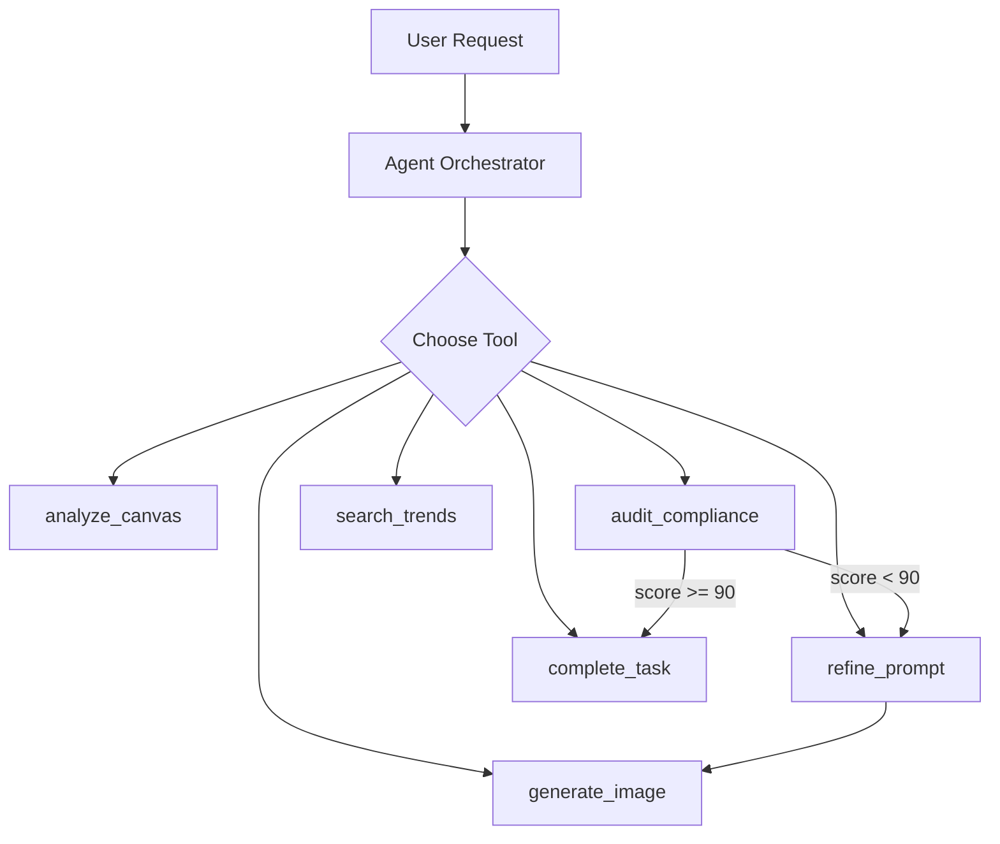

# Sentient Studio - Product Requirements Document

> AI-Powered Marketing Asset Generator with Autonomous Agents

---

## Overview

Sentient Studio enables marketing teams to create on-brand assets through an AI-powered workflow:

1. **Canvas**: Upload moodboard images and define brand elements
2. **Constitution**: AI extracts brand DNA (colors, style, voice, restrictions)
3. **Generation**: Agent autonomously creates marketing assets
4. **Audit**: AI validates brand compliance, retries if needed
5. **Output**: Approved asset ready for use

---

## Architecture

### Technology Stack

- **Frontend**: Next.js 15 (App Router, React 19, TypeScript)
- **Styling**: Tailwind CSS with cyberpunk theme
- **State**: Zustand stores (canvas, campaign)
- **Database**: Firestore (constitution memory, campaigns)
- **AI**: Gemini 2.0 Flash + Nano Banana image generation
- **Deployment**: Vercel (100% free tier)

### Agentic System

This is a **true agentic system**, not a simple API wrapper:



---

## Agent Tools

| Tool | Purpose | Input | Output |
| ---- | ------- | ----- | ------ |
| `analyze_canvas` | Extract brand DNA | Canvas elements | BrandConstitution |
| `generate_image` | Create via Nano Banana | Prompt, style, colors | Base64 image |
| `audit_compliance` | Check guidelines | Image, constitution | Score, issues |
| `refine_prompt` | Fix issues | Prompt, feedback | Refined prompt |
| `search_trends` | Web research | Query | Trend summary |
| `complete_task` | Signal done | Success, message | Final result |

---

## Data Schemas

### BrandConstitution

```typescript
interface BrandConstitution {
  visual_identity: {
    color_palette_hex: string[];
    photography_style: string;
    forbidden_elements: string[];
  };
  voice: {
    tone: string;
    keywords: string[];
  };
  risk_thresholds: {
    nudity: "STRICT_ZERO_TOLERANCE" | "MODERATE" | "RELAXED";
    political: "STRICT_ZERO_TOLERANCE" | "MODERATE" | "RELAXED";
  };
}
```

### AgentAction

```typescript
interface AgentAction {
  timestamp: number;
  tool: string;
  input: Record<string, unknown>;
  output: unknown;
  thinking?: string; // Visible AI reasoning
}
```

---

## Key Features

### 1. Visible AI Reasoning (Thinking Mode)

Uses `gemini-2.0-flash-thinking-exp` to expose the AI's reasoning process in real-time.

### 2. Cross-Session Memory

Brand constitutions are persisted to Firestore and loaded on subsequent sessions.

### 3. Self-Correcting Loop

If audit score < 90%, agent automatically:

1. Calls `refine_prompt` with feedback
2. Regenerates image
3. Re-audits (max 3 attempts)

### 4. Real-Time Streaming

Server-Sent Events stream agent actions to the dashboard for live feedback.

### 5. Native Image Generation

Uses Nano Banana (Gemini's native image generation) instead of external APIs.

---

## API Endpoints

| Route | Method | Purpose |
| ----- | ------ | ------- |
| `/api/agent` | POST | Stream agent execution via SSE |
| `/api/analyze` | POST | Analyze canvas (legacy) |
| `/api/generate` | POST | Generate enhanced prompt (legacy) |
| `/api/audit` | POST | Audit asset (legacy) |

---

## Demo Flow

```text
1. Open /canvas
2. Drag & drop moodboard images
3. Add color swatches and notes
4. Navigate to /dashboard
5. Enter: "Create a summer sale poster"
6. Click "Run Agent"
7. Watch real-time activity feed:
   💭 "Analyzing moodboard for brand colors..."
   → analyze_canvas()
   💭 "I see tropical vibes, using cyan and coral..."
   → generate_image()
   💭 "Checking against forbidden elements..."
   → audit_compliance()
   ✅ Task complete!
8. Download generated asset
```

---

## Environment Variables

```env
# Required
GEMINI_API_KEY=

# Firebase (for persistence)
NEXT_PUBLIC_FIREBASE_API_KEY=
NEXT_PUBLIC_FIREBASE_AUTH_DOMAIN=
NEXT_PUBLIC_FIREBASE_PROJECT_ID=
```

---

## Future Enhancements

- [ ] Multi-asset campaigns
- [ ] Image editing (inpainting)
- [ ] A/B variant generation
- [ ] Brand guideline PDF upload
- [ ] Team collaboration
