# Sentient Studio

> **AI-Powered Brand Intelligence for the Creator Economy**  
> Built with **Gemini 3** • Next.js 15 • Multi-Agent Orchestration

[](https://nextjs.org)
[](https://ai.google.dev)
[](https://typescriptlang.org)
[](https://opensource.org/licenses/MIT)

---

## 🚀 The Vision

**Feature parity is not a moat.** Generic tools like Canva give you templates. **Sentient Studio learns your brand.**

Sentient Studio is an autonomous brand manager that extracts your unique "visual DNA" from your existing content and ensures every new asset—whether a thumbnail, banner, or social post—is perfectly on-brand. It’s not just a design tool; it’s a **collaborative intelligence**.

### Why Sentient Studio?

| Feature | Generic AI Tools | Sentient Studio |
| :--- | :--- | :--- |
| **Brand Knowledge** | None (starts from scratch) | **Persistent Brand Memory** (Learns from history) |
| **Style Source** | "Describe your style" (Text) | **Extracts DNA from Images** (Visual Analysis) |
| **Quality Control** | Generate & Hope | **Multi-Agent Compliance Loop** (Audit & Verify) |
| **Reasoning** | Black Box | **Visible Thinking** (Gemini 3 Native) |

---

## 🧠 Multi-Agent Architecture

Sentient Studio isn't a single AI model. It is a **Symphony of Specialized Agents**, orchestrated to deliver professional results.

```mermaid
graph TD
    User[User Request] --> Orchestrator[⚡ Orchestrator Agent]
    
    subgraph "Core Intelligence"
        Orchestrator --> DNA[🧬 Brand DNA Analyst]
        Orchestrator --> Creative[🎨 Creative Director]
        Orchestrator --> Auditor[⚖️ Compliance Auditor]
    end
    
    subgraph "Support Services"
        Orchestrator --> Trend[📈 Trend Scout]
        Orchestrator --> Memory[🧠 Context Memory]
    end
    
    DNA -->|Brand Constitution| Creative
    Creative -->|Draft Asset| Auditor
    Auditor -->|Compliance Score| Orchestrator
```



### The Agents

1. **⚡ Orchestrator (Flash):** The "Brain." Routes tasks, manages state, and synthesizes outputs.
2. **🧬 Brand DNA Analyst (Pro):** Extracts color palettes, typography, and "vibe" from your uploads.
3. **🎨 Creative Director (Pro Image):** Generates high-fidelity, 4K assets using the Brand Constitution.
4. **⚖️ Compliance Auditor (Flash):** Reviews every generated asset against your brand rules before you see it.
5. **🧠 Context Memory:** Remembers your edits, preferences, and feedback across sessions.

---

## ✨ Key Features (Opus 4.5)

### 1. 🧬 Brand Extraction

Drop in your moodboard or existing thumbnails. The **Brand DNA Agent** analyzes them to build a `BrandConstitution`—a strict set of visual rules (colors, fonts, composition) that guides all future generation.

### 2. 👁️ Visual Grounding

The agent "sees" what it builds. Using the **Gemini Files API**, generated assets are fed back into the context, allowing the agent to critique its own work and make intelligent refinements.

### 3. 🎨 Hybrid Canvas Editor

Best of both worlds.

* **AI Edit:** "Make the text pop more," "Add a sale badge."
* **Manual Edit:** Drag, drop, resize, and draw using the Fabric.js canvas.
* **Mask Inpainting:** Select a specific area to regenerate without touching the rest.

### 4. 🧠 Visible Thinking

Powered by **Gemini 3**, you can see the agent's thought process in real-time. Watch it reason about your brand, debate design choices, and formulate a plan before it draws a single pixel.

---

## 🛠️ Tech Stack

* **Framework:** [Next.js 15](https://nextjs.org/) (App Router, Server Actions)
* **AI Core:** Google Gemini 3 (Flash & Pro Image)
* **Canvas Engine:** [Fabric.js 6](http://fabricjs.com/)
* **State Management:** Zustand
* **Database:** Firebase Firestore (Brand Memory Persistence)
* **Styling:** Tailwind CSS + Shadcn UI
* **Validation:** Zod (Strict JSON Schema Enforced)

---

## ⚡ Quick Start

### Prerequisites

* Node.js 18+
* Google Gemini API Key (with Gemini 1.5/3.0 access)

### Installation

1. **Clone the repository**

    ```bash
    git clone https://github.com/Zhav1/sentient-studio.git
    cd sentient-studio
    ```

2. **Install dependencies**

    ```bash
    npm install
    ```

3. **Configure Environment**
    Create a `.env.local` file:

    ```env
    NEXT_PUBLIC_GEMINI_API_KEY=your_gemini_api_key_here
    NEXT_PUBLIC_FIREBASE_API_KEY=...
    # See .env.example for full list
    ```

4. **Run Development Server**

    ```bash
    npm run dev
    ```

5. **Open Studio**
    Navigate to `http://localhost:3000`

---

## 🗺️ Roadmap & Status

**Current Phase: ✅ Opus 4.5 Hardening (Complete)**

* [x] **Tiered Intelligence:** Optimized model routing (Flash for speed, Pro for quality).
* [x] **Parallel Tool Execution:** Faster agent loops.
* [x] **Visual Grounding:** Agents can see the canvas.
* [x] **Brand Persistence:** Long-term memory of your visual style.

**Coming Soon:**

* [ ] Real-time Multi-Brand Kit implementation.
* [ ] Vercel Production Deployment.

---

## 📄 License

MIT License. Built for the Google Gemini Developer Competition.
